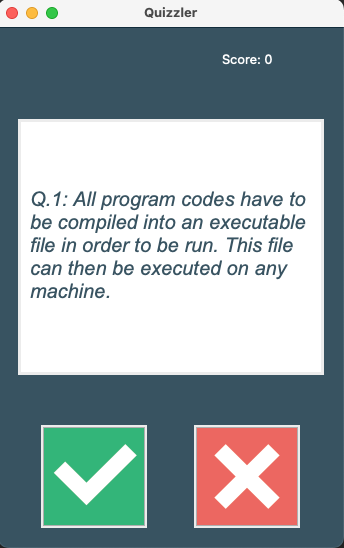
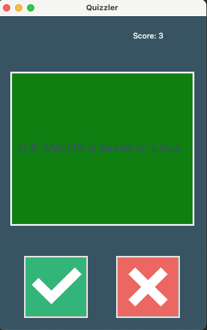
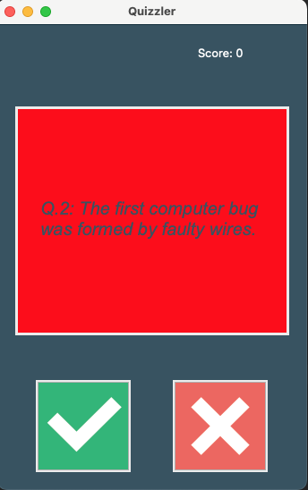

# Quiz App

Test and improve your skills using this quiz app

It uses the open Trivia Database to get the questions https://opentdb.com/api_config.php

- It is a True or False quiz, where you can hit Green button for True and Red button for False.
- Your updated score will be shown in the top-right corner of the screen.
- If your answer is correct, the screen will turn Green, and your score will increase

- If your answer is incorrect, the screen will appear Red

## Requirements
- Requires requests module

### Usage
- Run main.py to start the program
